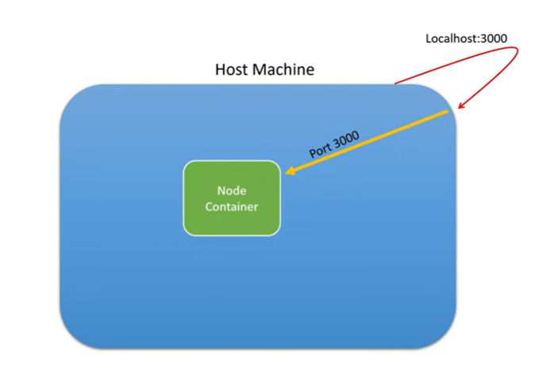
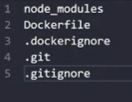

# Learn-Docker

## Commands 
1. Build the docker image 
   ```
   docker build -t node-app-image .
   ```
   here is the . ( dot ) is the path of the Dockerfile

   Note that ,when you run this command the first time, it will install the node images, run all the commands in the dockerfile, will execute the layers. When running the 2nd time, the execution will be much faster since the data is stoed in the cache by docker. This will make it faster

2. List all the docker images 
   ```
   docker image ls
   ```
   This will list all the docker images

3. Removing a docker image 
   ```
   docker image rm IMAGE_ID
   ```
   This will remvoe the docker image.
   Here is the IMAGE_ID is hte id of the docker-image which you want to remoev

4. Create a contianer for the docker image and run it 
   ```
   docker run -p 3000:3000 -d --name node-app <REPOSITORY>
   ```
    Runs the dockeer container on port 3000 
    3000:3000 , means that when the request is sent to localhost:3000 , then it will forward it to hte docker container. < LOCAL SYSTEM PORT NUMBER > : < DOCKER MACHINE PORT NUMBER >
    -d -> means detached execution ,this terminal will not be running contrinuous, which will allow to run more commands i nthe same terminal 
    --name node-app -> this is the name of the container
    <REPOSITORY> -> This is the docker image ( the repo ) 

5. Check if docker is running 
    ```
    docker ps
    ```
    This will list down the docker containers that are up and running

6. Remove the container 
   ```
   docker rm node-app -f
   ```
   Removes teh container ( node-app ) 
   -f -> this means forcefully

7. Login to the docker container
   ```
   docker exec -it node-app bash
   ```
   This will login the docker container ( node-app )
   Name ofthe container here is -> node-app. It allows to run cli commands in the terminal.

   Use ```exit`` to exit out of the docker file system

8. Bind Volume
   ```
   docker run -v <PATH TO THE FOLDER ON LOCATION ON LOCAL MACHINE>:<PATH TO THE FOLDER ON THE DOCKER CONTAINER> -p 3000:3000 -d --name node-app node-app-image
   ```

   ```
   docker run -v D:\GitHub\Learn-Docker:/app -p 3000:3000 -d --name node-app node-app-image
   ```
   This will sync the file on the local machine to the docker container. Changes made in the file on the local machine will be reflected on the docker container.

   You can reduce the complexity of the command using variables

    * For Windows command shell ( cmd ) 
    ```
    docker run -v %cd%:/app -p 3000:3000 -d --name node-app node-app-image
    ``` 

    * For Windows powershell ( pshell ) 
    ```
    docker run -v %{pwd}:/app -p 3000:3000 -d --name node-app node-app-image
    ```

    * For Bash/Linux/Mac
    ```
    docker run -v ${pwd}:/app -p 3000:3000 -d --name node-app node-app-image
    ```

    However, if the changes are not reflected, it means that the changes have been synced but the server is down. It is because, the node process was stopped ( killed ). Just like how we run node < APP >.js.
    We have to install __nodemon__ to keep the server up and running so that the sync will be made and the server is running. 

    Use __nodemon__

9. View logs
    ```
    docker logs <CONATAINER NAME>
    ```
    Here it is, 
    ```
    docker logs node-app
    ```

10. Telling docker to not sync a folder/file
    ```
    docker run -v ${pwd}:/app -v /app/node_modules -p 3000:3000 -d --name node-app node-app-image
    ```
    It tells docker to not sync the node_modules folder


# Concepts

1. 
  
Docker container, PORT explaination

2. .dockerignore file -> just like .gitignore , list down the files which we do not need in the docker container. 
  

Enter into the docker file system and type ```ls``` , the .dockerignore file won't be there.

3. Any updates made into hte local machine files ( like index.js ), will not be reflected in real-time in the docker-deployment. This is because, the image will needed to be built again, and re-run. The docker container will have the stale docker image, so re--build, to update it.
```
docker build -t <DOCKER IMAGE> .
```
```
docker run -p 3000:3000 -d --name <DOCKER CONTAINER> <DOCKER IMAGE>
```

To avoid the rebuilding process, we use __Volumes__.

4. if you remove the node_modules folder , run the docker conatainer, the application will crash. This is because , the node_modules file is not there, server will not work without packages. Deleting the node_modules folder will sync this action in the /app as well, so it will delete the node_modules in the docker container as well. So, the docker container will tun into problems as packages are not found. 